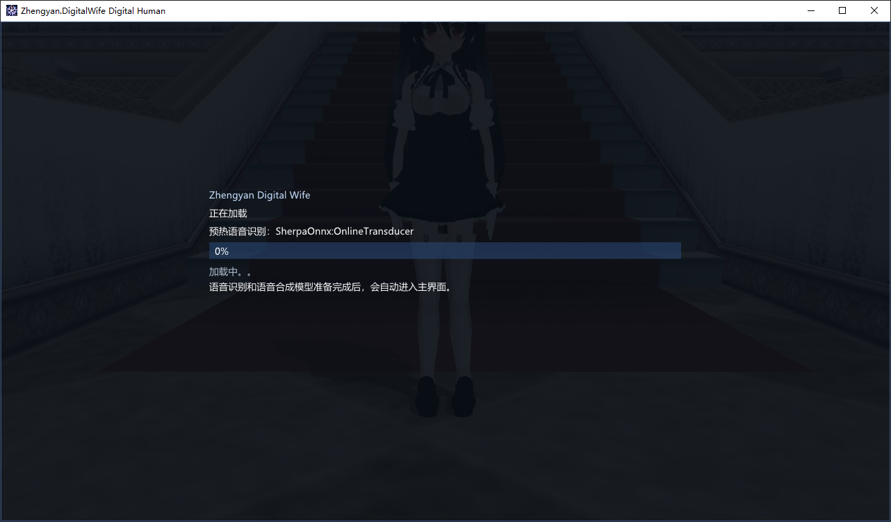
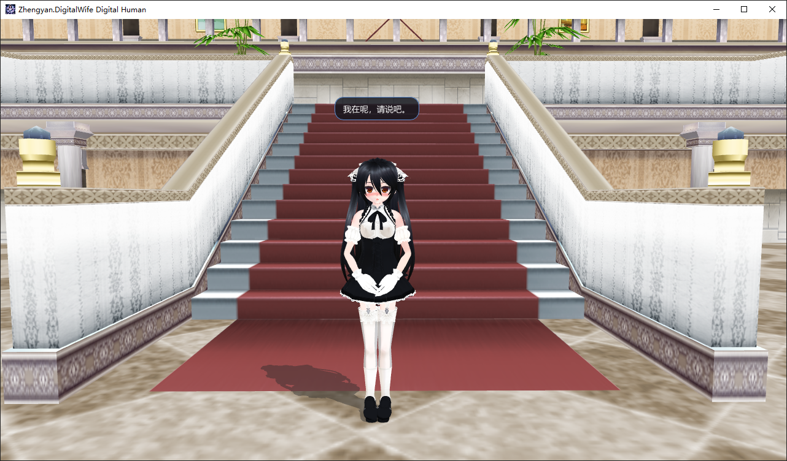
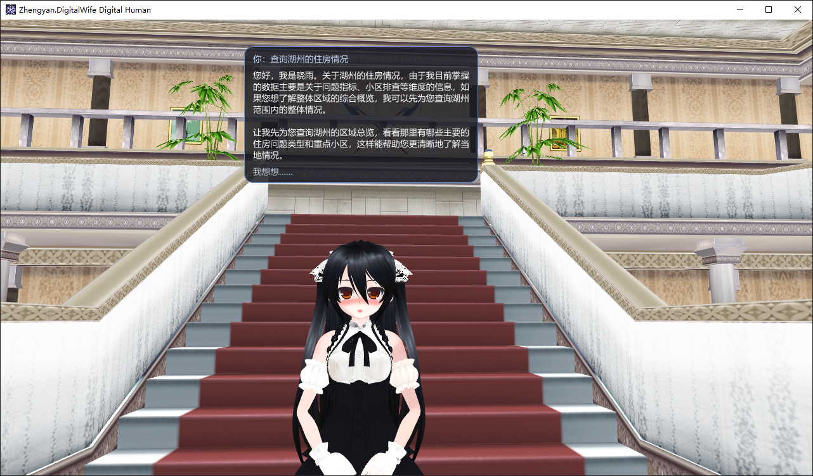



`Zhengyan.DigitalWife.Samples.DigitalHuman` 是一个跨平台数字人示例项目，演示如何把语音采集、唤醒词、ASR、LLM、TTS 和 3D 角色驱动串起来，形成一条完整的实时对话链路。

## 预览







## 启动方式

```powershell
dotnet run --project samples/Zhengyan.DigitalWife.Samples.DigitalHuman/Zhengyan.DigitalWife.Samples.DigitalHuman.csproj
```

## 配置文件

- `appsettings.json`
- `appsettings.Local.json`
- `appsettings.Local.example.json`

`appsettings.Local.json` 通常用于本机覆盖配置。你也可以直接通过 `appsettings.json` 来改默认值。

## 窗口图标

`WindowIconPath` 用来指定窗口图标路径，支持相对路径。建议把图标放在仓库资源目录下，例如：

```json
"WindowIconPath": "Resources/Logo/logo.png"
```

## 配置总览

### 角色与场景资源

| 字段 | 作用 | 详细说明 |
| --- | --- | --- |
| `Character.Body.Path` | 角色身体模型路径。 | 指向角色主体的 PMX 文件。这个模型通常决定角色的基础外形、骨骼和材质，是整个角色加载的核心入口。 |
| `Character.Wearables` | 服饰和配件模型列表。 | 用于挂载衣服、头饰、装饰件等可替换部件。每一项都可以单独指定路径，并决定是否跟随角色骨骼和光照。 |
| `Character.Actions.Stand` | 待机动作组。 | 角色进入默认停留状态时使用的动作集合。一般用于唤醒后未开始说话、或者对话结束后回到静止状态。 |
| `Character.Actions.Wait` | 等待动作组。 | 角色处于“正在等待下一步输入”时使用的动作集合，通常比 `Stand` 更有轻微动态感。 |
| `Character.Actions.Walk` | 行走动作组。 | 角色移动时使用的动作集合。即使当前项目里不做真实位移，也可以用来表现移动过渡。 |
| `Character.Actions.Run` | 跑步动作组。 | 角色快速移动时使用的动作集合。适合做更强的运动表现或切换场景时的动作。 |
| `Scene.Models` | 场景 PMX 模型列表。 | 用来加载场景中的桌椅、教室、房间、道具等静态或半静态模型。多个场景元素可以并列配置。 |
| `Scene.Lighting` | 场景和角色统一光照参数。 | 控制主光、环境光、阴影和地面投影等参数。这个配置会同时影响角色和场景的视觉风格。 |
| `Scene.BackgroundMusic.Path` | 背景音乐路径。 | 指向对话场景使用的 BGM 文件。通常用于营造氛围，支持在不同场景中单独替换。 |

这些字段适合直接通过 `appsettings.json` / `appsettings.Local.json` 替换，不需要改代码，主要影响角色外观、镜头氛围和资源组合方式。

### 语音链路

| 字段 | 作用 | 默认值 | 详细说明 |
| --- | --- | --- | --- |
| `RecognitionProvider` | 默认 ASR 供应商。 | `sherpa` | 兼容旧配置的兜底选择。当你只希望写一个默认引擎时，这个字段会作为最初的尝试对象保留。 |
| `RecognitionPriority` | ASR 引擎优先级列表。 | `[]` | 决定实际识别顺序，数组越靠前越先尝试；不放进列表的引擎就等于禁用。 |
| `SherpaRecognizer` | SherpaOnnx ASR 配置。 | `null` | 配置 SherpaOnnx 的具体识别模型路径、模型类型、线程数等参数。可用于 `OnlineTransducer` 或 `OfflineTransducer`。 |
| `WhisperRecognizer` | Whisper.net ASR 配置。 | `null` | 配置 Whisper.net 的模型路径与推理参数。可作为 Sherpa 的回退方案，也可以单独启用。 |
| `Tts` | SherpaOnnx TTS 配置。 | `null` | 配置语音合成模型的路径与说话人相关参数。当前项目可用 `vits*` 和 `matcha*` 两类模型。 |
| `DeleteCapturedAudioAfterRecognition` | 识别完成后自动删除录音。 | `false` | 打开后会在识别完成并得到文本后删除已经处理过的 wav 文件，适合长期运行，避免 `captured` 目录不断堆积。 |
| `SpeechOutput.Volume` | 播放音量。 | `1.0` | 控制最终播报输出的响度比例，过高可能导致爆音，过低会让语音不清楚。 |
| `SpeechOutput.Speed` | 语速。 | `1.0` | 控制 TTS 输出的整体速度，数值越大说话越快，越小说话越慢。 |
| `SpeechOutput.SpeakerId` | 声音说话人 ID。 | `0` | 多说话人模型使用的发音人编号。单说话人模型通常只需要 `0`。 |

`RecognitionPriority` 决定实际尝试顺序；`RecognitionProvider` 主要用于兼容只写单引擎的旧配置。

### LLM

| 字段 | 作用 | 详细说明 |
| --- | --- | --- |
| `Llm.BaseUrl` | LLM 服务地址。 | 大模型服务的根地址，例如 OpenAI 兼容接口的 `http://host:port/v1`。 |
| `Llm.ApiKey` | API Key。 | 访问 LLM 服务时使用的鉴权密钥。如果你的服务不需要鉴权，也可以按实际实现留空。 |
| `Llm.ChatCompletionsPath` | Chat Completions 路径。 | 拼接到 `BaseUrl` 后用于请求聊天补全接口的路径。不同服务的路径可能不同。 |
| `LlmModel` | 模型名称。 | 发送给服务端的模型标识，例如某个具体的对话模型名称。 |
| `SystemPrompt` | 系统提示词。 | 进入对话前注入给模型的系统级提示内容，用来约束角色风格、回复语气和行为边界。 |

### 对话与唤醒

| 字段 | 作用 | 默认值 | 详细说明 |
| --- | --- | --- | --- |
| `Conversation.WakeWords` | 唤醒词列表。 | `[]` | 这里配置数字人会响应的唤醒词。数组中的每一项都会参与匹配，通常会放入多个近义表达来提高唤醒成功率。 |
| `Conversation.WakeWordListeningTimeout` | 唤醒词监听超时。 | `8s` | 启动唤醒监听后，最长允许等待多久。超过这个时间还没听到唤醒词，就退出当前监听轮次。 |
| `Conversation.WakeWordChunkDuration` | 唤醒词识别分片时长。 | `2s` | 控制每次送进识别器的音频片段长度。片段越短越灵敏，但上下文越少；片段越长则更稳，但响应可能更慢。 |
| `Conversation.UseFallbackRecognizersForWakeWord` | 唤醒词是否允许回退识别器。 | `false` | 是否在唤醒词阶段允许使用备用 ASR 引擎。开启后更稳，但会增加额外开销。 |
| `Conversation.PostResponseIdleTimeout` | 单次回答后的空闲等待时间。 | `30s` | 这是回答结束后继续等用户讲话的时长，主要用于对话衔接，不代表回到待机状态的计时。 |
| `Conversation.ReturnToStandTimeout` | 回答结束后回到 `Stand` 的等待时间。 | `30s` | 这是回答结束后，如果一直没有新语音输入，就自动恢复到 `Stand` 待机状态的计时。 |
| `Conversation.ReturnToStandPromptText` | 回到 `Stand` 前的提醒语。 | `如果你后面还想继续聊，随时再轻轻叫我一声，我会在的。` | 到达 `ReturnToStandTimeout` 后，程序会先说这句话，再切回待机。适合做成温柔、简短、像数字人的收尾提示。 |
| `Conversation.MotionTransitionDuration` | 动作融合过渡时长。 | `1s` | 控制 `Stand`、`Wait`、`Walk`、`Run` 之间切换时的权重过渡时间，数值越大越柔和，越小越利落。 |
| `Conversation.MotionTransitions` | 动作对专用过渡时长表。 | `[]` | 这里可以按 `Source` / `Target` 单独覆盖某一组动作的过渡时长，例如单独给 `Walk -> Run` 和 `Run -> Walk` 配不同的融合时间；未命中的动作对会继续使用 `MotionTransitionDuration`。融合结束后是否重置物理，也会按目标动作的 `ResetPhysicsOnLoop` 决定。 |
| `Conversation.ResponseChunking` | LLM 回复分段策略。 | 见下表 | 控制“LLM 还没完全返回时，什么时候就先开始送一句去 TTS”。适合降低首段回复延迟。 |
| `Conversation.SpeechDictionaryDirectory` | 口型字典目录。 | `Resources/SpeechLipSyncDictionaries` | 存放口型映射字典的目录，主要用于把文本与口型变化关联起来。 |
| `Conversation.SpeechDictionaryLanguage` | 口型字典语言。 | `Chinese` | 选择当前对话内容对应的口型字典语言。一般中文对话用 `Chinese`，日文素材可切到 `Japanese`。 |
| `Conversation.HistoryMaxMessages` | 对话历史最大条数。 | `12` | 控制会保留多少轮历史消息进入上下文。数值越大上下文越完整，但也会增加 LLM 请求负担。 |
| `Conversation.WakeWordCapture` | 唤醒词录音参数。 | 见下表 | 用来配置唤醒词阶段的音频采集行为，包括采样率、帧大小、静音判断和最短/最长时长。 |
| `Conversation.UserCapture` | 用户语音录音参数。 | 见下表 | 用来配置正常对话阶段的音频采集行为，通常会比唤醒词阶段更关注识别稳定性。 |

`PostResponseIdleTimeout` 表示回答结束后还要继续等用户再说话多久；`ReturnToStandTimeout` 表示多久没新输入就回到 `Stand`；`MotionTransitionDuration` 表示默认的动作融合时间；`MotionTransitions` 则是某些动作对的专用覆盖表。

例如，如果你希望 `Walk -> Run` 的加速过渡更短，可以这样写：

```json
"Conversation": {
  "MotionTransitionDuration": "00:00:01",
  "MotionTransitions": [
    {
      "Source": "Walk",
      "Target": "Run",
      "Duration": "00:00:00.600"
    },
    {
      "Source": "Run",
      "Target": "Walk",
      "Duration": "00:00:00.600"
    }
  ]
}
```

这里的 `Source` / `Target` 对应 `Stand`、`Wait`、`Walk`、`Run` 这四个动作组；如果某个方向没有单独配置，就继续使用 `MotionTransitionDuration`。

这意味着：融合结束后是否重置物理，会跟目标动作的 `ResetPhysicsOnLoop` 保持一致。

#### `Conversation.ResponseChunking`

| 字段 | 作用 | 默认值 | 详细说明 |
| --- | --- | --- | --- |
| `EnableClauseBoundaries` | 是否在逗号/分号/冒号处提前切分。 | `true` | 开启后，遇到 `，`、`；`、`：` 这类分隔符时，不必等到句号才开始 TTS，能更早播出短语。 |
| `MinClauseCharacters` | 分句最小字符数。 | `12` | 防止太短的碎片过早送进 TTS。比如一句里刚出现一个逗号，但前半句太短时，程序会继续等一等。 |
| `MaxBufferedCharacters` | 最长缓冲字符数。 | `320` | 如果 LLM 一直没有给出明显停顿，缓冲区达到这个长度时会强制切一段，避免一直等不到可播内容。 |

一般建议：

1. 如果你想尽快出声，保持 `EnableClauseBoundaries = true`。
2. 如果你觉得 TTS 切得太碎，可以把 `MinClauseCharacters` 调大一点，比如 `16` 或 `20`。
3. 如果你想更稳，可以把 `MaxBufferedCharacters` 适当调大，但不要无限增大，不然首段等待还是会变久。

如果你想直接套一组更自然的默认值，可以先参考下面这张表：

| 动作切换 | 建议时长 | 说明 |
| --- | --- | --- |
| `Stand -> Wait` | `00:00:00.800` | 从待机切到轻微活动，建议比默认略快一点。 |
| `Wait -> Stand` | `00:00:00.800` | 从轻微活动回到待机，保持和进入时一致会更自然。 |
| `Stand -> Walk` | `00:00:00.700` | 从静止开始走路，通常需要一点启动缓冲。 |
| `Walk -> Stand` | `00:00:00.700` | 停下来的动作建议和起步差不多。 |
| `Wait -> Walk` | `00:00:00.600` | 从等待切到行走，过渡可以稍短一点。 |
| `Walk -> Wait` | `00:00:00.600` | 行走回到等待时，动作收束也建议更干脆。 |
| `Walk -> Run` | `00:00:00.500` | 加速切到跑步时，过渡短一些会更有“发力”感。 |
| `Run -> Walk` | `00:00:00.500` | 从跑步降回行走时，保留一点过渡但不要太拖。 |
| `Stand -> Run` | `00:00:00.900` | 直接从静止切到跑步，通常需要更明显的启动感。 |
| `Run -> Stand` | `00:00:00.900` | 直接刹停时，动作收住可以稍微长一点。 |

这组值不是硬性标准，主要是为了给你一个“先能用”的起点。你可以把全局 `MotionTransitionDuration` 设成 `1s`，然后只给最容易突兀的动作对单独覆盖，比如 `Walk -> Run`、`Run -> Walk`。

下面是一份可以直接复制的 `Conversation` 配置片段，包含默认值和一组动作对覆盖：

```json
"Conversation": {
  "WakeWords": [ "晓雨", "小雨", "小宇", "小玉", "小鱼" ],
  "WakeWordListeningTimeout": "00:00:08",
  "UseFallbackRecognizersForWakeWord": false,
  "WakeWordChunkDuration": "00:00:02",
  "WakeWordExtensionDuration": "00:00:01.200",
  "WakeWordTrailingSilencePadding": "00:00:00.400",
  "PostResponseIdleTimeout": "00:00:30",
  "ReturnToStandTimeout": "00:00:30",
  "ReturnToStandPromptText": "如果你后面还想继续聊，随时再轻轻叫我一声，我会在的。",
  "MotionTransitionDuration": "00:00:01",
  "MotionTransitions": [
    { "Source": "Stand", "Target": "Wait", "Duration": "00:00:00.800" },
    { "Source": "Wait", "Target": "Stand", "Duration": "00:00:00.800" },
    { "Source": "Stand", "Target": "Walk", "Duration": "00:00:00.700" },
    { "Source": "Walk", "Target": "Stand", "Duration": "00:00:00.700" },
    { "Source": "Wait", "Target": "Walk", "Duration": "00:00:00.600" },
    { "Source": "Walk", "Target": "Wait", "Duration": "00:00:00.600" },
    { "Source": "Walk", "Target": "Run", "Duration": "00:00:00.500" },
    { "Source": "Run", "Target": "Walk", "Duration": "00:00:00.500" },
    { "Source": "Stand", "Target": "Run", "Duration": "00:00:00.900" },
    { "Source": "Run", "Target": "Stand", "Duration": "00:00:00.900" }
  ],
  "ResponseChunking": {
    "EnableClauseBoundaries": true,
    "MinClauseCharacters": 12,
    "MaxBufferedCharacters": 320
  },
  "SpeechDictionaryDirectory": "Resources/SpeechLipSyncDictionaries",
  "SpeechDictionaryLanguage": "Chinese",
  "HistoryMaxMessages": 12,
  "WakeAcknowledgementText": "我在，请说。",
  "ListeningPromptText": "我在听。",
  "ThinkingText": "我想想……"
}
```

### 录音参数

#### `Conversation.WakeWordCapture`

| 字段 | 作用 | 默认值 | 详细说明 |
| --- | --- | --- | --- |
| `SampleRate` | 采样率。 | `16000` | 每秒采集多少个音频样本。`16000` 是语音识别里非常常见的采样率，通常兼顾效果和性能。 |
| `Channels` | 声道数。 | `1` | 单声道输入。语音识别场景一般不需要立体声，单声道更省资源，也更符合模型输入要求。 |
| `FramesPerBuffer` | 每次读取的帧数。 | `256` | 每次从音频设备取出的缓冲帧数量。值越小延迟越低，但调用更频繁；值越大更稳，但反应会慢一些。 |
| `PreRoll` | 预缓存时长。 | `00:00:00.150` | 在开始正式识别前保留一小段前置音频，避免用户开头第一个字被截掉。 |
| `MinDuration` | 最小时长。 | `00:00:00.250` | 一次有效录音最少需要持续多久，太短的片段会被视为无效输入。 |
| `MaxDuration` | 最大时长。 | `00:00:05` | 一次唤醒词录音允许持续的最长时间，防止录音周期无限延长。 |
| `SilenceTimeout` | 静音超时。 | `00:00:00.500` | 连续静音达到这个时长后，认为当前录音已经结束。 |
| `SilenceThreshold` | 静音阈值。 | `0.015` | 判断“是不是静音”的音量阈值。数值越低越敏感，越高越不容易把背景噪声当成声音。 |

#### `Conversation.UserCapture`

| 字段 | 作用 | 默认值 | 详细说明 |
| --- | --- | --- | --- |
| `SampleRate` | 采样率。 | `16000` | 用户正常说话时的采样率，和识别模型输入保持一致最稳妥。 |
| `Channels` | 声道数。 | `1` | 单声道录音。对语音识别更友好，也减少数据处理成本。 |
| `FramesPerBuffer` | 每次读取的帧数。 | `256` | 控制用户语音输入的读写粒度。调小可以更快发现用户开口，但也会增加处理频率。 |
| `PreRoll` | 预缓存时长。 | `00:00:00.150` | 用来保留用户开口前的一小段音频，防止识别时丢掉第一个音节。 |
| `MinDuration` | 最小时长。 | `00:00:00.500` | 用户讲话必须达到的最短录音时间。太短通常不值得送进识别器。 |
| `MaxDuration` | 最大时长。 | `00:00:15` | 单次对话输入允许持续的最长时间，防止长时间不结束造成识别卡住。 |
| `SilenceTimeout` | 静音超时。 | `00:00:00.500` | 用户停止说话后，连续静音达到这个时长就认为本次输入结束。 |
| `SilenceThreshold` | 静音阈值。 | `0.015` | 判断背景噪音和语音的分界值。环境更安静时可以适当调低，噪声大时可适当调高。 |

### 角色语音气泡

| 字段 | 作用 | 默认值 | 详细说明 |
| --- | --- | --- | --- |
| `Character.SpeechBubble.Enabled` | 是否显示语音气泡。 | `true` | 开启后会在角色旁边显示当前说话内容，适合让用户直观看到识别和回复结果。 |
| `Character.SpeechBubble.Width` | 气泡宽度。 | `360` | 控制气泡显示区域的宽度。太窄会导致文字换行过多，太宽会占用更多画面空间。 |
| `Character.SpeechBubble.WorldOffset` | 世界坐标偏移。 | `0, 0.45, 0` | 控制气泡在 3D 场景中的挂载位置，决定它离角色头部、身体的相对位置。 |
| `Character.SpeechBubble.ScreenOffset` | 屏幕坐标偏移。 | `0, -12` | 控制气泡在屏幕上的最终位置偏移，适合微调显示观感。 |
| `Character.SpeechBubble.ShowUserText` | 是否显示用户文本。 | `true` | 开启后会把用户说的话也显示到气泡中，便于调试和演示。 |

## ASR 选择建议

`SherpaRecognizer.ModelKind` 决定使用哪种 SherpaOnnx 识别模型：

```json
"SherpaRecognizer": {
  "ModelKind": "OnlineTransducer",
  "TokensPath": "models/asr/sherpa-onnx-streaming-zipformer-zh-int8-2025-06-30/tokens.txt",
  "EncoderPath": "models/asr/sherpa-onnx-streaming-zipformer-zh-int8-2025-06-30/encoder.int8.onnx",
  "DecoderPath": "models/asr/sherpa-onnx-streaming-zipformer-zh-int8-2025-06-30/decoder.onnx",
  "JoinerPath": "models/asr/sherpa-onnx-streaming-zipformer-zh-int8-2025-06-30/joiner.int8.onnx",
  "Language": "zh",
  "Provider": "cpu",
  "SampleRate": 16000,
  "FeatureDim": 80,
  "Threads": 4,
  "DecodingMethod": "greedy_search"
}
```

`ModelKind` 支持：

- `OnlineTransducer`
- `OfflineTransducer`

两者都可以离线使用。名字里的 `Online` / `Offline` 主要是指识别方式和流式特性，不代表必须联网。

如果你想更偏低延迟，一般可以从下面几项开始调：

1. 把 `RecognitionPriority` 收窄到你真正要用的引擎。
2. 调低 `Conversation.UserCapture.SilenceTimeout`。
3. 适当减小 `FramesPerBuffer`。
4. 适当减小 `WakeWordChunkDuration` 和 `WakeWordExtensionDuration`。

## 推荐配置示例

如果你希望先拿到一个稳定、容易排查问题的默认配置，可以优先采用这一组思路：

| 项目 | 建议 |
| --- | --- |
| ASR | 先只保留一个主引擎，例如 `RecognitionPriority = [ "sherpa" ]`。 |
| 录音 | `FramesPerBuffer` 先保持 `256`，`SilenceTimeout` 先保持 `0.5s`。 |
| 对话 | `PostResponseIdleTimeout` 和 `ReturnToStandTimeout` 先保持 `30s`，`MotionTransitionDuration` 先保持 `1s`。 |
| 气泡 | `Character.SpeechBubble.Enabled = true`，方便直接看到识别和回复。 |
| 录音清理 | `DeleteCapturedAudioAfterRecognition = true`，避免目录长期堆积。 |
| TTS | 先选择一类模型，不要混用 `vits*` 和 `matcha*` 的路径结构。 |

## 低延迟建议

### 保守版

```json
{
  "DigitalHuman": {
    "RecognitionPriority": [ "sherpa" ],
    "Conversation": {
      "WakeWordChunkDuration": "00:00:01.600",
      "WakeWordExtensionDuration": "00:00:00.900",
      "WakeWordTrailingSilencePadding": "00:00:00.250",
      "PostResponseIdleTimeout": "00:00:20",
      "ReturnToStandTimeout": "00:00:20",
      "WakeWordCapture": {
        "FramesPerBuffer": 256,
        "PreRoll": "00:00:00.150",
        "MinDuration": "00:00:00.250",
        "MaxDuration": "00:00:05",
        "SilenceTimeout": "00:00:00.500",
        "SilenceThreshold": 0.015
      },
      "UserCapture": {
        "FramesPerBuffer": 256,
        "PreRoll": "00:00:00.150",
        "MinDuration": "00:00:00.500",
        "MaxDuration": "00:00:15",
        "SilenceTimeout": "00:00:00.500",
        "SilenceThreshold": 0.015
      }
    }
  }
}
```

### 激进版

```json
{
  "DigitalHuman": {
    "RecognitionPriority": [ "sherpa" ],
    "Conversation": {
      "WakeWordChunkDuration": "00:00:01.200",
      "WakeWordExtensionDuration": "00:00:00.600",
      "WakeWordTrailingSilencePadding": "00:00:00.150",
      "PostResponseIdleTimeout": "00:00:15",
      "ReturnToStandTimeout": "00:00:15",
      "WakeWordCapture": {
        "FramesPerBuffer": 128,
        "PreRoll": "00:00:00.100",
        "MinDuration": "00:00:00.200",
        "MaxDuration": "00:00:04",
        "SilenceTimeout": "00:00:00.300",
        "SilenceThreshold": 0.018
      },
      "UserCapture": {
        "FramesPerBuffer": 128,
        "PreRoll": "00:00:00.100",
        "MinDuration": "00:00:00.350",
        "MaxDuration": "00:00:12",
        "SilenceTimeout": "00:00:00.300",
        "SilenceThreshold": 0.018
      }
    }
  }
}
```

## 常见模型路径

### Sherpa ASR

| 字段 | 作用 | 详细说明 |
| --- | --- | --- |
| `ModelKind` | 模型类型。 | 决定使用流式识别还是离线识别。`OnlineTransducer` 更适合低延迟场景，`OfflineTransducer` 更适合一次性整段识别。 |
| `TokensPath` | 词表路径。 | 指向 token 文件，识别器会用它把模型输出映射成文本。 |
| `EncoderPath` | 编码器模型路径。 | Sherpa ASR 的核心模型文件之一。 |
| `DecoderPath` | 解码器模型路径。 | 参与解码过程的模型文件。某些模型会需要它。 |
| `JoinerPath` | Joiner 模型路径。 | 用于流式 transducer 的组合推理。 |
| `Language` | 语言。 | 指定识别语言，例如中文场景通常填 `zh`。 |
| `Provider` | 推理后端。 | 通常使用 `cpu`；如果本机环境支持，也可以按实际情况切换。 |
| `SampleRate` | 采样率。 | 和录音输入保持一致，通常是 `16000`。 |
| `FeatureDim` | 特征维度。 | 要和模型训练时使用的输入特征维度保持一致，常见值是 `80`。 |
| `Threads` | 线程数。 | 控制推理并行度，数值越高通常越吃 CPU。 |
| `DecodingMethod` | 解码方式。 | 决定识别时使用的搜索策略，常见是 `greedy_search`。 |

```json
"SherpaRecognizer": {
  "ModelKind": "OnlineTransducer",
  "TokensPath": "models/asr/sherpa-onnx-streaming-zipformer-zh-int8-2025-06-30/tokens.txt",
  "EncoderPath": "models/asr/sherpa-onnx-streaming-zipformer-zh-int8-2025-06-30/encoder.int8.onnx",
  "DecoderPath": "models/asr/sherpa-onnx-streaming-zipformer-zh-int8-2025-06-30/decoder.onnx",
  "JoinerPath": "models/asr/sherpa-onnx-streaming-zipformer-zh-int8-2025-06-30/joiner.int8.onnx",
  "Language": "zh",
  "Provider": "cpu",
  "SampleRate": 16000,
  "FeatureDim": 80,
  "Threads": 4,
  "DecodingMethod": "greedy_search"
}
```

### TTS 模型

| 字段 | 作用 | 详细说明 |
| --- | --- | --- |
| `ModelPath` | 模型文件路径。 | 指向 TTS 主模型文件，不同模型类型对应的文件名不同。 |
| `TokensPath` | 词表路径。 | 用来把文本转换成模型可处理的 token。 |
| `LexiconPath` | 词典路径。 | 主要用于 `matcha*` 这类模型，帮助文本到发音的转换。 |
| `DataDir` | 模型目录。 | 模型相关附属资源目录，通常用于统一放置该模型的一组文件。 |

#### `vits*`

| 字段 | 作用 | 详细说明 |
| --- | --- | --- |
| `ModelPath` | 模型文件路径。 | 一般指向 `*.onnx` 的 vits 主模型文件。 |
| `TokensPath` | 词表路径。 | 负责 token 映射。 |
| `DataDir` | 模型目录。 | 如果模型还带有辅助资源，可以放在这里。 |

#### `matcha*`

| 字段 | 作用 | 详细说明 |
| --- | --- | --- |
| `ModelPath` | 模型文件路径。 | 一般指向 `model-steps-*.onnx` 这类 matcha 主模型文件。 |
| `TokensPath` | 词表路径。 | 负责 token 映射。 |
| `LexiconPath` | 词典路径。 | matcha 模型通常需要词典文件来辅助发音生成。 |
| `DataDir` | 模型目录。 | 建议与模型文件放在同一个目录，便于部署和迁移。 |

`vits*` 和 `matcha*` 的文件组织方式不完全一样，配置时不要混用同一套路径字段。`matcha*` 一般更依赖词典和额外资源，所以目录结构要保持完整。

## 备注

- `DeleteCapturedAudioAfterRecognition = true` 适合长期运行，能自动清理已经识别完成的 wav 文件。
- 如果你希望优先使用某个 ASR 引擎，可以通过 `RecognitionPriority` 控制顺序。
- 如果你希望彻底禁用某个引擎，只要不把它放进 `RecognitionPriority` 即可。
