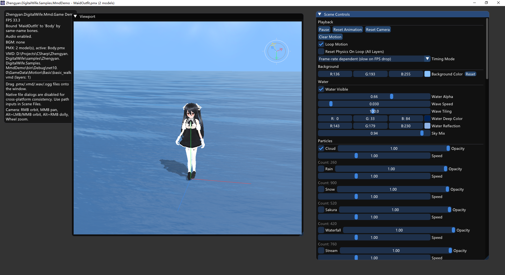

这个示例会把同一份 logo 复制到输出目录，并在启动时写死设置为窗口图标（路径是 Resources/Logo/logo.png）。

`Zhengyan.DigitalWife.Samples.MmdDemo` 是带 ImGui 面板的完整 MMD 调试示例，用于验证模型加载、动作层、口型驱动、粒子、水面、BGM 和文件拖拽等能力。

## 功能

- 默认加载示例角色与基础动作
- ImGui 控制面板
- PMX / VMD / WAV / OGG 拖拽加载
- 多模型管理与关系绑定
- 动作层权重调节
- 口型驱动与字典加载
- 口型驱动支持日语 / 中文字典切换
- 水面与多种粒子预设
- 背景音乐播放控制

## 预览



## 运行

```powershell
dotnet run --project samples/Zhengyan.DigitalWife.Samples.MmdDemo/Zhengyan.DigitalWife.Samples.MmdDemo.csproj
```

也可以显式指定模型和动作：

```powershell
dotnet run --project samples/Zhengyan.DigitalWife.Samples.MmdDemo/Zhengyan.DigitalWife.Samples.MmdDemo.csproj -- "path/to/model.pmx" "path/to/motion.vmd"
```

## 默认资源

启动时默认尝试加载：

- `GameData/Character/Body/Body.pmx`
- `GameData/Motion/Basic/basic_walk.vmd`
- `Resources/SpeechLipSyncDictionaries/`

## 适合什么场景

- 调试 `Mmd.Game` 能力是否完整可用
- 查看动作层、粒子、水面和口型驱动效果
- 做新功能开发前的验证沙箱

补充文档：

- [MMD Game API 详细说明](../../docs/Zhengyan.DigitalWife.Mmd.Game.API.md)
- [资源与渲染说明](../../docs/Zhengyan.DigitalWife.Mmd.Game.Rendering-And-Assets.md)

